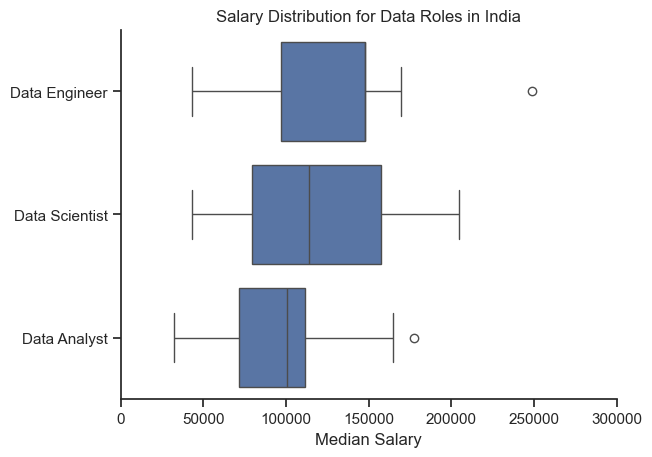

# The Overview

Welcome to my analysis of the data job market, focusing on data analyst roles. This project was created out of a desire to navigate and understand the job market more effectively. It delves into the top-paying and in-demand skills to help find optimal job opportunities for data analysts.

The data sourced from [Luke Barousse's Python Course](https://lukebarousse.com/python) which provides a foundation for my analysis, containing detailed information on job titles, salaries, locations, and essential skills. Through a series of Python scripts, I explore key questions such as the most demanded skills, salary trends, and the intersection of demand and salary in data analytics.

# The Questions

Below are the questions I want to answer in my project:

### Note

India is set as the default location, focusing on the top three selected job titles. You can modify the script to change the country and adjust variables as needed.

### 1. In-Demand Skills

What are the most frequently requested skills for the top job titles in the data sector?
### 2. Skills and Compensation

What is the correlation between specific skills and compensation levels?
### 3. Optimal Skills

Which skills should be prioritized for learning based on demand and compensation?
### 5. Top Employers

Who are the leading employers for data professionals in India?

# Tools I Used

For my deep dive into the data analyst job market, I harnessed the power of several key tools:

- **Python:** The backbone of my analysis, allowing me to analyze the data and find critical insights.I also used the following Python libraries:
    - **Pandas Library:** This was used to analyze the data. 
    - **Matplotlib Library:** I visualized the data.
    - **Seaborn Library:** Helped me create more advanced visuals. 
- **Jupyter Notebooks:** The tool I used to run my Python scripts which let me easily include my notes and analysis.
- **Visual Studio Code:** My go-to for executing my Python scripts.
- **Git & GitHub:** Essential for version control and sharing my Python code and analysis, ensuring collaboration and project tracking.

# Data Preparation and Cleanup

This section outlines the steps taken to prepare the data for analysis, ensuring accuracy and usability.

## Import & Clean Up Data

I start by importing necessary libraries and loading the dataset, followed by initial data cleaning tasks to ensure data quality.

```python
# Importing Libraries
import ast
import pandas as pd
import seaborn as sns
from datasets import load_dataset
import matplotlib.pyplot as plt  

# Loading Data
dataset = load_dataset('lukebarousse/data_jobs')
df = dataset['train'].to_pandas()

# Data Cleanup
df['job_posted_date'] = pd.to_datetime(df['job_posted_date'])
df['job_skills'] = df['job_skills'].apply(lambda x: ast.literal_eval(x) if pd.notna(x) else x)
```

## Filter India Jobs

To focus my analysis on the India job market, I apply filters to the dataset, narrowing down to roles based in the India.

```python
selected_country='India'
df_sel=df[df['job_country']==selected_country]
```

# The Analysis

Each Jupyter notebook for this project aimed at investigating specific aspects of the data job market. Here’s how I approached each question:

## 1. What are the most demanded skills for the top 3 most popular data roles?

To find the most demanded skills for the top 3 most popular data roles. I filtered out those positions by which ones were the most popular, and got the top 5 skills for these top 3 roles. This query highlights the most popular job titles and their top skills, showing which skills I should pay attention to depending on the role I'm targeting. 

View my notebook with detailed steps here: [Skill Demand Analysis](2_Skill_Demand.ipynb).

### Visualize Data

```python
fig, ax = plt.subplots(no_of_title,1)
fig.set_size_inches((10, no_of_title*2))
sns.set_theme(style='ticks')
for i,title in enumerate(title_list):
    df_plot=df_skill_per[df_skill_per['job_title_short']==title].head(5)
    sns.barplot(data=df_plot,x='skill_per',y='job_skills',ax=ax[i],hue='skill_per',legend=False)
    ax[i].set_title(title)
    ax[i].set_xlabel('')
    ax[i].set_ylabel('')
    ax[i].set_xlim(0,80)

    if i != len(title_list) -1: # for removing x-label
        ax[i].set_xticks([])

    for n,v in enumerate(df_plot['skill_per']): # showing data points in chart
        ax[i].text(v+1,n,f"{v:.0f}%", va='center')

fig.suptitle(f'Percentage of Skills Requested in {selected_country} Job Postings', fontsize=15)
fig.tight_layout(h_pad=0.5) # fix the overlap
plt.show()
```

### Results


*Bar graph visualizing the salary for the top 3 data roles and their top 5 skills associated with each.*

### Insights:

- **High Demand for SQL Across Roles**: SQL appears in 52% of Data Analyst and 68% of Data Engineer job postings, highlighting its crucial role in data management and manipulation across different data professions.

- **Specialization in Data Roles**:
  - **Data Analysts**: Emphasis is placed on traditional data analysis tools with Excel appearing in 35% of postings, and visualization tools like Tableau and Power BI appearing in 27% and 21% of postings, respectively.
  - **Data Scientists**: There's a strong emphasis on programming with Python appearing in 70% of postings and statistical analysis with R appearing in 33% of postings, underscoring their importance for advanced data modeling and analytics.

- **Cloud Technologies for Data Engineers**: Skills in cloud services like AWS and Azure are highly sought after, appearing in 37% and 36% of Data Engineer job postings respectively, indicating the importance of cloud infrastructure knowledge in modern data engineering tasks.

## 2. How well do jobs and skills pay for Data Analysts?

To identify the highest-paying roles and skills, I only got jobs in the India and looked at their median salary. But first I looked at the salary distributions of common data jobs like Data Scientist, Data Engineer, and Data Analyst, to get an idea of which jobs are paid the most. 

View my notebook with detailed steps here: [Salary Analysis](3_Salary_Analysis.ipynb).

#### Visualize Data 

```python
fig , ax = plt.subplots(2,1)

sns.set_theme(style='ticks')
sns.barplot(data=df_skill_pay,x='median',y=df_skill_pay.index,hue='median',ax=ax[0],legend=False)
ax[0].set_title(f'Highest Paid Skills for Data Analysts in the {selected_country}')
ax[0].set_ylabel('')
ax[0].set_xlabel('')
ax[0].xaxis.set_major_formatter(plt.FuncFormatter(lambda x, _: f'${int(x/1000)}K'))


sns.barplot(data=df_skills_top,x='median',y=df_skills_top.index,hue='median',ax=ax[1],legend=False)
ax[1].set_title(f'Highest In Demand Skills for Data Analysts in the {selected_country}')
ax[1].set_ylabel('')
ax[1].set_xlabel('')
ax[1].xaxis.set_major_formatter(plt.FuncFormatter(lambda x, _: f'${int(x/1000)}K'))

plt.tight_layout()
plt.show()
```

#### Results

  
*Box plot visualizing the salary distributions for the top 3 data job titles.*

#### Insights

Data Engineers earn the highest median salary, with a broad salary range indicating significant variation in earnings. Data Scientists have a median salary close to that of Data Engineers, but their salary distribution is more concentrated around the median, suggesting fewer extreme salary values. In contrast, Data Analysts have the lowest median salary, although a few outliers indicate that some Data Analysts earn significantly more than the majority.


### Highest Paid & Most Demanded Skills for Data Analysts

Next, I narrowed my analysis and focused only on data analyst roles. I looked at the highest-paid skills and the most in-demand skills. I used two bar charts to showcase these.

#### Visualize Data

```python
fig , ax = plt.subplots(2,1)

sns.set_theme(style='ticks')
sns.barplot(data=df_skill_pay,x='median',y=df_skill_pay.index,hue='median',ax=ax[0],legend=False)
ax[0].set_title(f'Highest Paid Skills for Data Analysts in the {selected_country}')
ax[0].set_ylabel('')
ax[0].set_xlabel('')
ax[0].xaxis.set_major_formatter(plt.FuncFormatter(lambda x, _: f'${int(x/1000)}K'))


sns.barplot(data=df_skills_top,x='median',y=df_skills_top.index,hue='median',ax=ax[1],legend=False)
ax[1].set_title(f'Highest In Demand Skills for Data Analysts in the {selected_country}')
ax[1].set_ylabel('')
ax[1].set_xlabel('')
ax[1].xaxis.set_major_formatter(plt.FuncFormatter(lambda x, _: f'${int(x/1000)}K'))

plt.tight_layout()
plt.show()
```

#### Results
Here's the breakdown of the highest-paid & most in-demand skills for data analysts in the India:


*Two separate bar graphs visualizing the highest paid skills and most in-demand skills for data analysts in the India.*

#### Insights:

- **Highest Paid Skills for Data Analysts**: 
  - PostgreSQL, PySpark, GitLab, and Linux are among the highest-paying skills, with salaries reaching up to $160K.
  - Skills like MySQL, GDPR, and MongoDB also contribute to higher salaries, slightly below the top-paying skills.

- **Most In-Demand Skills for Data Analysts**:
  - Power BI, Spark, and Tableau are the top in-demand skills, with salaries nearing $100K.
  - Python, SQL, and Excel remain highly sought-after, reflecting their essential role in data analysis.
  - Cloud platforms like Azure and AWS, along with programming languages such as R, are also in demand but offer slightly lower compensation.


## 4. What are the most optimal skills to learn for Data Analysts?

To identify the most optimal skills to learn ( the ones that are the highest paid and highest in demand) I calculated the percent of skill demand and the median salary of these skills. To easily identify which are the most optimal skills to learn. 

View my notebook with detailed steps here: [Optimal Skill](4_Optimal_Skill.ipynb).

#### Visualize Data

```python
f_plot=df_skill_pay[df_skill_pay['skill_per']>5]

sns.scatterplot(data=df_plot,y='median',x='skill_per')
plt.xlabel('Percent of Data Analyst Jobs')
plt.ylabel('Median Salary ($USD)')  # Assuming this is the label you want for y-axis
plt.title('Most Optimal Skills for Data Analysts in the India')
```

#### Results

    
*A scatter plot visualizing the most optimal skills (high paying & high demand) for data analysts in the India.*

#### Insights:

- **MongoDB** offers the **highest median salary** (~$160K) but is associated with a lower percentage of job opportunities (~10%).
- **SQL, Excel, and Python** are among the most widely required skills, each appearing in about **35-50% of data analyst jobs**, with salaries around **$100K-$120K**.
- **Power BI, Tableau, and Azure** are popular skills with **20-30% job market demand**, offering median salaries between **$100K-$120K**.
- Skills like **SQL Server, AWS, and Oracle** are associated with lower salaries (below $90K) and are less in demand, appearing in less than **15% of jobs**.
- **Redshift and Hadoop** are relatively less demanded, with a lower median salary (~$80K), suggesting a niche or specialized market for these skills.


### Visualizing Different Techonologies

Let's visualize the different technologies as well in the graph. We'll add color labels based on the technology (e.g., {Programming: Python})

#### Visualize Data

```python

df_plot.set_index('skills',inplace=True)
sns.set_theme(style='ticks')
sns.scatterplot(data=df_plot,y='median',x='skill_per', hue='technology')
plt.xlabel('Percent of Data Analyst Jobs')
plt.ylabel('Median Salary ($USD)')  # Assuming this is the label you want for y-axis
plt.title('Most Optimal Skills for Data Analysts in the India')

```

#### Results

  
*A scatter plot visualizing the most optimal skills (high paying & high demand) for data analysts in the India with color labels for technology.*

#### Insights:

- **Key programming skills** for data analyst jobs in India are **Python** and **SQL**, both appearing in **around 50%** of job postings. These roles offer a **median salary of $100,000**.
  
- **Analyst tools** like **Excel** and **Tableau** are also in demand:
  - **Excel** shows up in about **41% of job postings**.
  - **Tableau** is present in **20%** of postings.

- **Other notable insights**:
  - The number of data analyst jobs in India is relatively **low**, so it's difficult to draw significant conclusions from this limited data.
  - **R**, **Power BI**, and **cloud technologies** like **Azure** and **AWS** are also featured in a smaller percentage of postings.

## 5. Who are the leading employers for data professionals in India?

To Identify the leading employers I will plot Top Employer by No of Job posting and Top Employer by Median Salary Offered.

### Visualizing Data of Leader by Scatter Plot

```python 
sns.set_theme(style='ticks')
sns.barplot(data=df_plot1,x='count',y='company_name',hue='count',legend=False)
sns.despine()
plt.xlabel("No. of Jobs")
plt.ylabel("")
plt.title(f"Number of Jobs for {selected_title} in Top Companies Across {selected_country}")
```
Code for Median Salaries Plot
```python
df_plot=df_sel.dropna(subset='salary_year_avg')
df_plot=df_plot.groupby('company_name')['salary_year_avg'].agg(['count','median']).sort_values(by='median',ascending=False).head(15)
sns.set_theme(style='ticks')
sns.barplot(data=df_plot,x='median',y='company_name')
sns.despine()
plt.xlabel("Median Salary")
plt.ylabel("")
plt.title(f"Median Salaries for {selected_title} in Top Companies Across {selected_country}")

```


### Results

  
*A Bar plot visualizing the Top Companies by no of Job Posting for data analysts in the India. *


  
*A Bar plot visualizing the Top Companies by Median Salary for data analysts in the India. *

#### Insights

- Top Companies by No of Job Posted are Seen Clearly in Graph There are more than 10 Companies with 40+ Job Posting.

- Top Companies by Median Salary is a bit Different Case as low no of Companies have listed salaries. But A few Companies with high Median Salaries are Visible.

# What I Learned

Throughout this project, I deepened my understanding of the data analyst job market and enhanced my technical skills in Python, especially in data manipulation and visualization. Here are a few specific things I learned:

- **Advanced Python Usage**: Utilizing libraries such as Pandas for data manipulation, Seaborn and Matplotlib for data visualization, and other libraries helped me perform complex data analysis tasks more efficiently.
- **Data Cleaning Importance**: I learned that thorough data cleaning and preparation are crucial before any analysis can be conducted, ensuring the accuracy of insights derived from the data.
- **Strategic Skill Analysis**: The project emphasized the importance of aligning one's skills with market demand. Understanding the relationship between skill demand, salary, and job availability allows for more strategic career planning in the tech industry.


# Insights

This project provided several general insights into the data job market for analysts:

- **Skill Demand and Salary Correlation**: There is a clear correlation between the demand for specific skills and the salaries these skills command. Advanced and specialized skills like Python and Oracle often lead to higher salaries.
- **Economic Value of Skills**: Understanding which skills are both in-demand and well-compensated can guide data analysts in prioritizing learning to maximize their economic returns.


# Challenges I Faced

This project was not without its challenges, but it provided good learning opportunities:

- **Data Inconsistencies**: Handling missing or inconsistent data entries requires careful consideration and thorough data-cleaning techniques to ensure the integrity of the analysis.
- **Complex Data Visualization**: Designing effective visual representations of complex datasets was challenging but critical for conveying insights clearly and compellingly.
- **Balancing Breadth and Depth**: Deciding how deeply to dive into each analysis while maintaining a broad overview of the data landscape required constant balancing to ensure comprehensive coverage without getting lost in details.


# Conclusion

This exploration into the data analyst job market has been incredibly informative, highlighting the critical skills and trends that shape this evolving field. The insights I got enhance my understanding and provide actionable guidance for anyone looking to advance their career in data analytics. As the market continues to change, ongoing analysis will be essential to stay ahead in data analytics. This project is a good foundation for future explorations and underscores the importance of continuous learning and adaptation in the data field.